 

  

 
 
  Visitor count 
  

<h1 align="center">Hi 👋, I'm Shuvam Paul</h1>
<h3 align="center">A passionate developer and a student</h3>
<h3 align="left">Languages and Tools:</h3>

  
- 🌱 I’m currently juggling between **Python**, **Dart, Flutter** and a bit of **C,Java**

- 💬 Ask me about **Python** ( most comfortable )

- 📫 How to reach me - **Discord most preferably maybe [h_y_d_r_a_x#8064](https://discord.com/users/1073884543980933221)**

- 📨 Also Reach me by **Email** - [shuvampaul@duck.com](mailto:shuvampaul@duck.com)

<h3 align="left">Connect with me: </h3>

 
 
 
 

